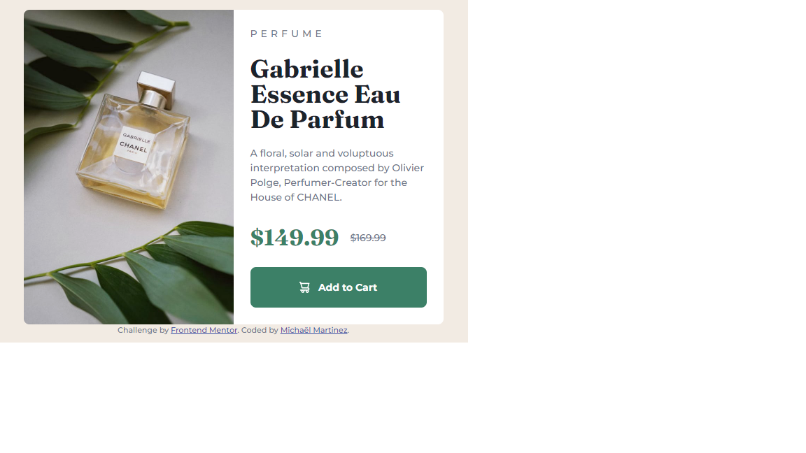

## Table of contents

- [Overview](#overview)
  - [The challenge](#the-challenge)
  - [Screenshot](#screenshot)
- [My process](#my-process)
  - [Built with](#built-with)
  - [What I learned](#what-i-learned)
  - [Useful resources](#useful-resources)
- [Author](#author)
- [Acknowledgments](#acknowledgments)

## Overview

This is my solution to the [Product preview card component challenge on Frontend Mentor](https://www.frontendmentor.io/challenges/product-preview-card-component-GO7UmttRfa). Frontend Mentor challenges help you improve your coding skills by building realistic projects. 

### The challenge

Users should be able to:

- View the optimal layout depending on their device's screen size
- See hover and focus states for interactive elements

### Screenshot

## My process

### Built with

- Semantic HTML5 markup
- CSS custom properties
- Flexbox
- CSS Grid
- Mobile-first workflow

### What I learned

- CSS custom prpperties
- HTML picture and sourceset
- data-icon
- Better understanding of CSS grid
- Using simple media queries using a mobile-first workflow
- Understanding different CSS resets
- Assisigning better names to my classes

### Useful resources

- [Example resource 1](https://www.youtube.com/@KevinPowell) - Great youtuber explaining basic HTML & CSS
- [Example resource 2](https://courses.kevinpowell.co/) - The Conquering Responsive Layouts course, was my first introduction to responsive layouts. This gave me a basic understanding if responsive web layouts and media queries.

## Author

- Frontend Mentor - [@yourusername](https://www.frontendmentor.io/profile/ZeroPlus93)

## Acknowledgments

Great thanks to Kevin Powell, teaching free content in a great and simple way so beginners like me can understand HTML & CSS
